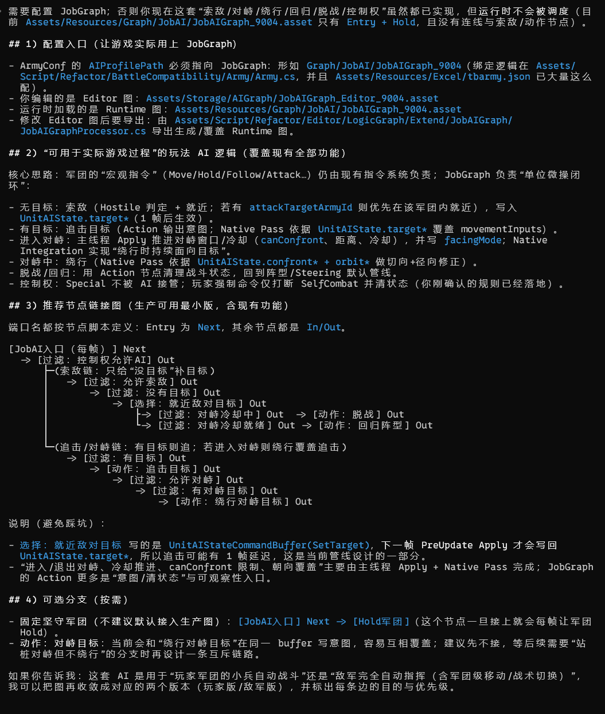

下面按 tasks.md 的 3.1~3.3 给你“可复现的明确验收步骤”（只在对话里列，不回填文件）。

  ## 先决条件（建议统一用 BattleTestScene）

  1. Unity 打开场景：Assets/Test/BattlePlayground/Scene/BattleTestScene.unity，点 Play。
  2. 聚焦到 Game 窗口（否则键盘不会进游戏）。
  3. 选择军团（新选择系统默认已启用）：
      - 全选玩家军团：按 `（BackQuote）
      - 选第 1~5 个玩家军团：按 1~5（Shift 可保持/追加选择）

  ———

  ## 3.1 跟随：能跟随玩家移动，并验证“朝向语义”

  目标： 按下跟随后，军团会持续追随玩家；在移动/停止时朝向变化应平滑且可解释（不抖、不瞬转、不莫名回
  正）。

  步骤：

  1. 确保在 TPS 模式（BattleTestEntrance 里默认 TPS；Z 可在 TPS/RTS 间切换）。
  2. 选中一个玩家军团（1）。
  3. 按 C（TPS Follow）。
  4. 用你的角色移动方式（WASD/摇杆）让玩家走一段“S 形路线 + 急停”。观察：军团会持续追你的位置，停下后会
     收拢并停住。
  5. 验证朝向语义（推荐做 2 个动作对比）：
      - A) 只走直线：观察军团朝向随移动方向平滑旋转，不出现突然跳到世界 Vector3.forward 的“回正”。
      - B) 原地转相机后再移动：把相机水平转 120°~180°，再让玩家横移/前进，观察军团朝向变化应连续、无抖
        动/抽搐。

  ———

  ## 3.2 坚守/攻击/巡逻：切换战术后状态正确；非循环巡逻到终点转坚守

  ### A) 坚守（Hold）

  1. 选中军团（1）。
  2. 先让军团处于“会移动”的状态（任选其一即可）：
      - 方式 1：按 C 跟随，走几步让军团动起来；或
      - 方式 2：切到 RTS（按 Z），右键点击地面下达移动（RTS/Planning 的右键点击=移动）。
  3. 按 S（Hold）。
  4. 期望：军团停止继续前进，并保持当前位置（不会继续“偷偷往旧目标点走”）。

  ### B) 攻击（Attack，追击目标军团中心）

  1. 确保 UI 顶部有“兵团头顶条/军团条”（BattlePanel）。
  2. 先选中“攻击发起方军团”（左键点它的头顶条，或按 1 选中）。
  3. 对“目标军团”的头顶条 鼠标右键。
  4. 期望：发起方军团进入追击（朝目标军团中心移动）；目标军团移动时，追击目标点会持续刷新。
  5. 立刻按 S，期望：追击被打断，军团停住。

  ### C) 巡逻（Patrol）+ “非循环到终点转坚守”

  1. 选中军团（1）。
  2. 按 P：下达“非循环两点巡逻”。
  3. 观察：军团会依次走到两个点（点位是以当前军团朝向推导出来的前方/右侧各约 6m）。
  4. 等到到达第 2 个点后，期望：军团自动停住（等价“转坚守”）。
  5. 验证循环巡逻：按 Shift + P，期望：到第 2 点后会回到第 1 点，持续循环（不会到终点就停）。

  ———

  ## 3.3 战斗状态：进入战斗创建 BattleArea；退出战斗销毁；1 秒兜底检查有效

  你需要看到的现象： 小地图出现/消失 BattleArea（绑定层只对 Player/Friendly 创建）。

  推荐步骤（仍在 BattleTestScene）：

  1. 在场景里找到 BattleTestEntrance 物体：勾选 battleData.generateEnemies，并确保至少生成 1 个敌人，且
     出生点离你的军团不远（越近越容易触发交互）。
  2. Play 后，把敌人“引到你的军团附近”，让敌人开始对军团单位产生攻击/受击交互（关键是要发生战斗交互事
     件）。
  3. 观察小地图：军团进入交互后，应出现对应的 BattleArea（创建应幂等，不应疯狂重复创建导致闪烁）。
  4. 结束交互（杀掉敌人/拉开距离让交互停止）。
  5. 观察小地图：BattleArea 应在“最后一次交互结束后”延迟一小段时间后消失；按当前实现，通常会在约
     2s（Timed 黑板过期）+ <=1s（兜底检查节流） 内消失。

  ———

  ## 你问的：测试前要不要先在 JobAIGraph 配置“跟随/坚守/攻击/巡逻”？

  - 验收 3.1~3.3 不需要你先在 JobAIGraph 里额外配置节点：这些战术切换/巡逻推进/战斗状态聚合与 BattleArea
    触发都在主线程兼容层闭环，JobAIGraph 在本阶段主要是“能读到输入状态”的数据通道。
  - 如果你想顺手确认 JobAIGraph 资源/绑定没问题：
      1. 确认运行时图资源存在：Assets/Resources/Graph/JobAI/JobAIGraph_9004.asset
      2. 确认军团配置的 AIProfilePath 指向 Graph/JobAI/JobAIGraph_9004（在 Assets/Resources/Excel/
         tbarmy.json 里能看到）
      3. Play 时 Console 不应出现 [JobAI] 绑定失败：加载 JobAIGraphRuntime 失败 -> ... 之类报错
      4. （可选）打开 Assets/Storage/AIGraph/JobAIGraph_Editor_9004.asset，Play 模式下在 JobGraph 窗口
         点“调试(运行时可用)”，能看到节点上的 Stream.Count 刷新（用于确认调度/回传链路通）

  你准备先用 BattleTestScene 跑，还是打算在主线关卡/地城里跑？我可以按你选的场景，把第 3.3 的“怎么稳定触
  发进入/退出战斗”再收敛成更稳的动作序列。

---

        - 确认参与验收的军团配置 AIProfilePath 包含 Graph/JobAI/（工程里 Assets/Resources/Excel/
        tbarmy.json 已大量配置为 Graph/JobAI/JobAIGraph_9004）。
      - 进入 Play 后看 Console：不能出现 "[JobAI] 绑定失败：加载 JobAIGraphRuntime 失败"（绑定逻辑在
        Assets/Script/Refactor/BattleCompatibility/Army/Army.cs）。
      - 重要：当前运行时图 Assets/Resources/Graph/JobAI/JobAIGraph_9004.asset 里只看到 Entry + Hold 两个
      - 观察：A 应优先追击 B；击杀/回收 B 后，应清目标并在后续评估重新选择 C（或其它最近 Hostile）。
  - 3.2 对峙（持续/冷却）
      - 让 A 接近目标到 fireRange 内：应进入对峙并开始绕行，同时持续面向目标。
      - 观察默认时长：对峙约 2.5s，结束后冷却约 1.5s，冷却期不应反复抖动进入对峙。
  - 3.3 绕行（Orbit）
      - 让目标超距/死亡触发清目标后：单位应停止追击/绕行覆盖，回到 Steering/阵型管线的行为轨道（表现为回
        归坑位/队形）。
  - 3.5 控制权（玩家强制命令）
      - 用调试手段把某单位 UnitAIState.controlAuthority 置为 SelfCombat，然后对该军团下达玩家命令（Move/
        Hold/Follow/Attack/AttackNoTarget）。
      - 通过 Buff/属性变更拉大/缩小 searchRange/fireRange，观察下一次评估是否按新范围索敌/进入对峙。
      - 使用 CanConfront=false 的单位验证：应禁止进入对峙/绕行。

  ———

  - 绑定本身通常不需要你额外配：只要 ArmyConf 的 AIProfilePath 指向 Graph/JobAI/... 就会自动绑定
    （Assets/Resources/Excel/tbarmy.json 已是 Graph/JobAI/JobAIGraph_9004）。
  - 但你需要配置“JobGraph 的内容并导出”：目前运行时图 Assets/Resources/Graph/JobAI/JobAIGraph_9004.asset
    只包含 Entry + Hold，不会产生目标选择与对峙绕行。
      - 编辑对应的 Editor 图：Assets/Storage/AIGraph/JobAIGraph_Editor_9004.asset

## 配置说明
